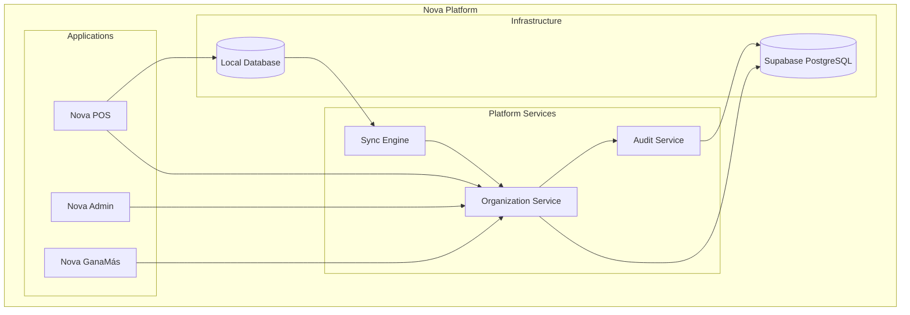
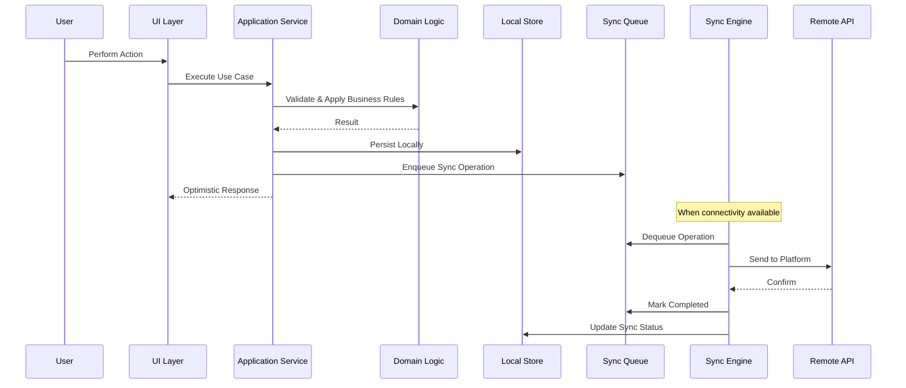
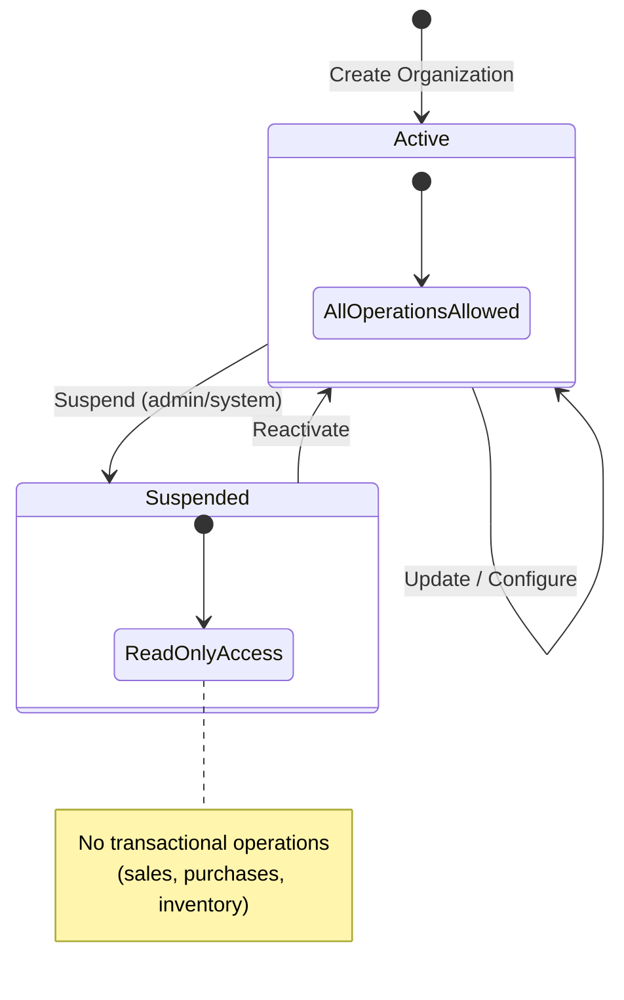
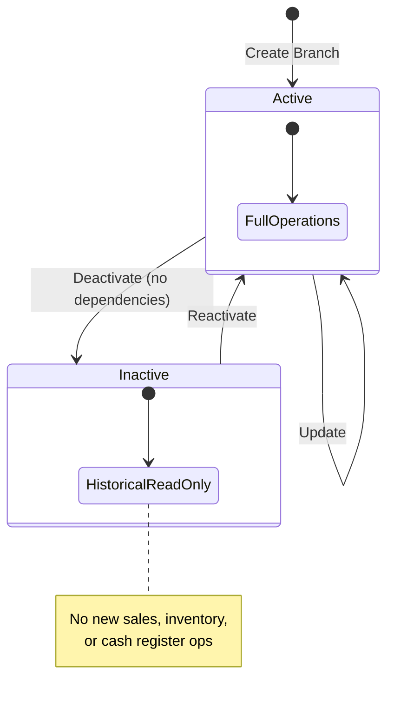

# Design Document: Organization Management

## Overview

This document defines the technical design for the Organization Management domain — the foundational Platform Service of Nova Platform. It covers the creation, management, configuration, and lifecycle of organizations and branches (sucursales), including offline-first data availability, synchronization, tenant isolation, and auditability.

Organization Management is a **shared platform service** consumed by all Nova products (Nova POS, Nova GanaMás, future products). It establishes the multi-tenant boundary: every organization is a tenant, and all business data is scoped to exactly one organization.

### Key Design Drivers

- **Offline First**: Organization and branch data must be available locally for Nova POS to function without connectivity.
- **Multi-Tenant Isolation**: Every data operation must be scoped to the current tenant. Cross-tenant access is architecturally impossible.
- **Synchronization**: Changes made offline must queue locally and sync automatically when connectivity returns.
- **Auditability**: All structural changes to organizations and branches must produce audit records.
- **Simplicity**: The design must remain straightforward — no unnecessary abstractions beyond what the domain requires.

### Architectural Style

Nova Platform follows a **Modular Monolith** architecture with **Lightweight DDD** and **Clean Architecture** principles:

- Each domain is an independent module with clear boundaries.
- Modules communicate through well-defined interfaces, never through internal implementation details.
- Business logic is encapsulated within domain modules. Infrastructure concerns are isolated.
- The architecture favors clarity over academic purity.

---

## Architecture

### System Context



### Data Flow Architecture



### Layered Architecture

| Layer | Responsibility | Location |
|-------|---------------|----------|
| **UI** | Forms, lists, status display | `apps/pos/`, `apps/admin/` |
| **Application** | Use case orchestration, transaction coordination | `packages/shared/domains/organization/application/` |
| **Domain** | Business rules, invariants, state transitions, validation | `packages/shared/domains/organization/domain/` |
| **Infrastructure** | Local persistence, remote API, sync queue implementation | `packages/shared/domains/organization/infrastructure/` |
| **Sync** | Queue management, conflict detection, retry logic | `packages/shared/sync/` |

### Layer Responsibilities

**Application Layer**
- Orchestrates use cases (create organization, update branch, etc.)
- Coordinates between Domain Layer, persistence, and Sync Queue
- Enforces Tenant Context on every operation
- Records audit entries after successful domain operations
- Does NOT contain business rules

**Domain Layer**
- Owns all business rules and invariants
- Validates inputs against domain constraints
- Controls state transitions (lifecycle management)
- Defines the Aggregate boundary and its consistency rules
- Does NOT know about persistence or infrastructure

**Infrastructure Layer**
- Implements Repository interfaces defined by the Domain Layer
- Manages local database read/write operations
- Manages remote API calls
- Implements the Sync Queue storage

**Offline Layer**
- Ensures all reads resolve from the local store
- All writes persist locally first, then enqueue for synchronization
- Provides sync status metadata for UI indicators

**Synchronization Layer**
- Processes the Sync Queue when connectivity is available
- Handles retry logic with exponential backoff
- Detects conflicts between local and remote state
- Reports sync status changes to the Application Layer

---

## Domain Model

### Aggregate Boundary

```
┌─────────────────────────────────────────────────────┐
│              Organization Aggregate                  │
│                                                     │
│  ┌───────────────────────────────────────────────┐  │
│  │  Organization (Aggregate Root)                │  │
│  │                                               │  │
│  │  - identity, legal info, status               │  │
│  │  - OrganizationConfiguration (Value Object)   │  │
│  │  - lifecycle transitions                      │  │
│  └───────────────────────────────────────────────┘  │
│                                                     │
│  ┌───────────────────────────────────────────────┐  │
│  │  Branch (Entity)                              │  │
│  │                                               │  │
│  │  - identity, location info, status            │  │
│  │  - lifecycle transitions                      │  │
│  │  - always belongs to one Organization         │  │
│  └───────────────────────────────────────────────┘  │
│                                                     │
└─────────────────────────────────────────────────────┘
```

**Aggregate Root**: Organization

The Organization is the entry point for all operations within this domain. It enforces the consistency boundary and owns the lifecycle of its branches.

**Transactional consistency boundary:** The aggregate defines the scope within which business invariants must be satisfied before a state change is committed. Branch is part of the Organization aggregate because its invariants (name uniqueness, lifecycle rules) depend on the parent Organization's state. This does NOT imply that every Branch must always be loaded into memory alongside the Organization — Repository implementations may optimize loading strategies (lazy loading, separate queries) while preserving aggregate consistency at the persistence boundary.

**Business Invariants enforced by the Aggregate:**

1. A Branch cannot exist without an Organization.
2. A Branch always belongs to exactly one Organization and cannot be transferred.
3. The Organization controls its own configuration.
4. The Organization controls its own lifecycle (active ↔ suspended).
5. Branch names must be unique within the Organization.
6. The tax identifier must be unique per country across the platform.
7. A Branch cannot be deactivated while it has unresolved operational dependencies.
8. A suspended Organization prevents new transactional operations across all its branches.

### Aggregate Root: Organization

Represents the business entity (tenant) that uses Nova Platform. Every data record in the system belongs to exactly one Organization.

**Responsibilities:**
- Maintains legal and commercial identity (legal name, trade name, tax identifier)
- Owns its configuration (timezone, currency, language, regional preferences)
- Controls its lifecycle status (active, suspended)
- Governs the creation and lifecycle of its branches

### Entity: Branch

Represents a physical location (sucursal) where the organization operates. Each branch manages its own inventory, terminals, sales, and cash register.

**Responsibilities:**
- Maintains location identity (name, address, phone)
- Controls its own lifecycle status (active, inactive)
- Enforces name uniqueness within its parent organization

### Value Object: OrganizationConfiguration

Groups the operational settings that define how an organization operates within the platform. Modeled as a Value Object because it has no independent identity — it exists only as part of an Organization.

```typescript
interface OrganizationConfiguration {
  timeZone: string;        // IANA timezone (e.g., "America/Mexico_City")
  currency: string;        // ISO 4217 code (e.g., "MXN")
  language: string;        // BCP 47 tag (e.g., "es")
  regionalPreferences: RegionalPreferences;
}

interface RegionalPreferences {
  dateFormat: string;      // e.g., "DD/MM/YYYY"
  numberFormat: string;    // e.g., "1,234.56"
  taxLabel: string;        // e.g., "RFC", "EIN", "NIT"
}
```

**Design rationale:** Grouping configuration as a Value Object provides a single extensibility point for future products. When Nova GanaMás or Nova Restaurant need additional configuration, the `OrganizationConfiguration` can be extended without modifying the Aggregate Root's identity or business rules.

**Country-based defaults:** When an organization is created, default configuration values are assigned based on the selected country. Supported defaults include MEX (Mexico), USA (United States), and COL (Colombia), with additional countries added as the platform expands.

### Domain Events

The Organization domain currently operates **synchronously**. All operations execute within a single request lifecycle — the Application Service orchestrates validation, persistence, audit recording, and sync enqueueing as a coordinated unit.

No asynchronous domain events are published in the current implementation.

As the platform evolves and additional domains require reactive integration (e.g., provisioning workflows, notification triggers, analytics), the following events may be introduced:

- `OrganizationCreated`
- `OrganizationSuspended`
- `OrganizationReactivated`
- `BranchCreated`
- `BranchDeactivated`

These are examples for future evolution and are **not part of the current design**. When domain events become necessary, they will be added as an explicit extension to this specification.

---

## Components and Interfaces

### Domain Types

```typescript
// Organization Aggregate Root
interface Organization {
  id: string;                              // UUID
  legalName: string;
  tradeName: string;
  taxIdentifier: string;
  country: string;                         // ISO 3166-1 alpha-3
  configuration: OrganizationConfiguration;
  contactEmail: string | null;
  contactPhone: string | null;
  address: string | null;
  status: OrganizationStatus;
  createdAt: string;                       // ISO 8601
  createdBy: string;                       // UUID
  updatedAt: string;                       // ISO 8601
  updatedBy: string;                       // UUID
}

type OrganizationStatus = 'active' | 'suspended';

// Branch Entity
interface Branch {
  id: string;                              // UUID
  organizationId: string;                  // UUID — immutable after creation
  name: string;
  address: string;
  phone: string;
  status: BranchStatus;
  createdAt: string;
  createdBy: string;
  updatedAt: string;
  updatedBy: string;
}

type BranchStatus = 'active' | 'inactive';
```

### Validation

```typescript
interface ValidationResult {
  valid: boolean;
  errors: FieldError[];
}

interface FieldError {
  field: string;
  message: string;
}

// Pure validation functions — no side effects, no persistence
function validateCreateOrganization(data: CreateOrganizationInput): ValidationResult;
function validateUpdateOrganization(data: UpdateOrganizationInput): ValidationResult;
function validateCreateBranch(data: CreateBranchInput): ValidationResult;
function validateUpdateBranch(data: UpdateBranchInput): ValidationResult;
```

### Application Service

The Application Service orchestrates use cases by coordinating the Domain Layer, Repository interfaces, and cross-cutting concerns (audit, sync).

```typescript
interface OrganizationApplicationService {
  // Organization use cases
  createOrganization(input: CreateOrganizationInput, userId: string): Promise<Result<Organization>>;
  getOrganization(orgId: string): Promise<Result<Organization>>;
  updateOrganization(orgId: string, input: UpdateOrganizationInput, userId: string): Promise<Result<Organization>>;
  updateConfiguration(orgId: string, input: ConfigurationInput, userId: string): Promise<Result<Organization>>;
  suspendOrganization(orgId: string, userId: string): Promise<Result<Organization>>;
  reactivateOrganization(orgId: string, userId: string): Promise<Result<Organization>>;

  // Branch use cases
  createBranch(orgId: string, input: CreateBranchInput, userId: string): Promise<Result<Branch>>;
  getBranch(orgId: string, branchId: string): Promise<Result<Branch>>;
  listBranches(orgId: string): Promise<Result<Branch[]>>;
  updateBranch(orgId: string, branchId: string, input: UpdateBranchInput, userId: string): Promise<Result<Branch>>;
  deactivateBranch(orgId: string, branchId: string, userId: string): Promise<Result<Branch>>;
  reactivateBranch(orgId: string, branchId: string, userId: string): Promise<Result<Branch>>;
}
```

### Repository Interfaces

Defined by the Domain Layer, implemented by the Infrastructure Layer. Every operation is implicitly scoped to the current Tenant Context.

```typescript
interface OrganizationRepository {
  save(org: Organization): Promise<void>;
  findById(orgId: string): Promise<Organization | null>;
  findByTaxIdentifier(taxId: string, country: string): Promise<Organization | null>;
  update(org: Organization): Promise<void>;
}

interface BranchRepository {
  save(branch: Branch): Promise<void>;
  findById(orgId: string, branchId: string): Promise<Branch | null>;
  findByName(orgId: string, name: string): Promise<Branch | null>;
  findAllByOrganization(orgId: string): Promise<Branch[]>;
  update(branch: Branch): Promise<void>;
  hasActiveDependencies(orgId: string, branchId: string): Promise<boolean>;
}
```

### Result Type

All Application Service operations return a `Result<T>` — business logic failures are values, not exceptions.

```typescript
type Result<T> =
  | { success: true; data: T }
  | { success: false; error: AppError };

interface AppError {
  code: string;
  message: string;
  fields?: FieldError[];
}
```

### Tenant Context

Every data operation must be scoped to a tenant. The Tenant Context is established at the Application Layer boundary and propagated to all Repository operations.

```typescript
interface TenantContext {
  organizationId: string;
  userId: string;
}
```

### Audit Interface

```typescript
interface AuditEntry {
  id: string;
  organizationId: string;
  entityType: 'organization' | 'branch';
  entityId: string;
  action: AuditAction;
  performedBy: string;
  performedAt: string;
  changes: Record<string, { from: unknown; to: unknown }>;
}

type AuditAction = 'created' | 'updated' | 'deactivated' | 'reactivated' | 'suspended';

interface AuditService {
  record(entry: Omit<AuditEntry, 'id' | 'performedAt'>): Promise<void>;
  getHistory(entityType: string, entityId: string): Promise<AuditEntry[]>;
}
```

### Sync Queue Interface

```typescript
interface SyncOperation {
  id: string;
  entityType: 'organization' | 'branch';
  entityId: string;
  operationType: 'create' | 'update';
  payload: Record<string, unknown>;
  status: SyncStatus;
  createdAt: string;
  attempts: number;
  lastAttemptAt: string | null;
  error: string | null;
}

type SyncStatus = 'pending' | 'in_progress' | 'completed' | 'failed';

interface SyncQueue {
  enqueue(operation: Omit<SyncOperation, 'id' | 'status' | 'attempts' | 'lastAttemptAt' | 'error'>): Promise<void>;
  dequeue(): Promise<SyncOperation | null>;
  markCompleted(operationId: string): Promise<void>;
  markFailed(operationId: string, error: string): Promise<void>;
  getPendingCount(): Promise<number>;
}
```

---

## Data Models

### Domain Types Summary

| Type | Kind | Description |
|------|------|-------------|
| `Organization` | Aggregate Root | The business entity (tenant) |
| `Branch` | Entity | A physical location within an organization |
| `OrganizationConfiguration` | Value Object | Operational settings (timezone, currency, language, regional) |
| `OrganizationStatus` | Enum | `'active'` or `'suspended'` |
| `BranchStatus` | Enum | `'active'` or `'inactive'` |
| `AuditEntry` | Entity | Immutable record of a domain mutation |
| `SyncOperation` | Entity | Queued operation pending remote synchronization |

---

## Persistence Strategy

### Remote Database (Supabase PostgreSQL)

The remote database is the system of record. It stores the canonical state of all organizations and branches.

**Key design decisions:**
- UUIDs as primary keys for all entities.
- Unique constraint on `(tax_identifier, country)` for organizations.
- Unique constraint on `(organization_id, name)` for branches.
- Row Level Security (RLS) enforces tenant isolation at the database level — every query is scoped to the current organization.
- Status fields use CHECK constraints to enforce valid lifecycle states.
- Audit log stored in a dedicated table with JSONB for change tracking.
- Timestamps use `TIMESTAMPTZ` for timezone-aware storage.

**Tables:**
- `organizations` — Organization records with configuration stored as JSONB
- `branches` — Branch records with foreign key to organizations
- `audit_log` — Append-only audit trail for all mutations

### Local Database (IndexedDB)

The local database provides offline availability for Nova POS. It mirrors the remote data relevant to the current organization and adds sync metadata.

**Key design decisions:**
- Local records extend domain types with sync metadata (`_syncStatus`, `_lastSyncedAt`, `_localVersion`, `_remoteVersion`).
- Indexed by organization ID for fast lookups.
- Sync status indexed for efficient queue processing.
- The local store is the primary read source for all UI operations — the application never reads directly from the remote database during normal operation.

**Sync metadata per record:**

| Field | Purpose |
|-------|---------|
| `_syncStatus` | `synced`, `pending`, or `conflict` |
| `_lastSyncedAt` | Timestamp of last successful sync |
| `_localVersion` | Incremented on each local mutation |
| `_remoteVersion` | Version received from remote on last sync |

### Synchronization Strategy

The Synchronization Layer follows the pattern: **Local Write → Queue → Remote Push → Confirm → Update Local Status**.

**Principles:**
- All writes persist locally first and return optimistically.
- A Sync Queue stores pending operations in order.
- The Sync Engine processes the queue when connectivity is available.
- Failed operations remain in the queue with incremented attempt count and are retried automatically.
- Conflict detection uses version comparison: if `_remoteVersion` has advanced since the local mutation, a conflict is flagged.
- Conflicts are stored locally for user resolution — the system never silently overwrites data.

**Offline error behavior:**
- Validation errors are returned immediately (client-side).
- Uniqueness conflicts (duplicate tax ID, duplicate branch name) may be deferred to sync time — optimistic creation locally.
- If a conflict is detected during sync, the record is flagged as `'conflict'` in the local store and the user is notified.

---

## State Machines

### Organization Lifecycle



**Transition rules:**
- Only active organizations can be suspended.
- Only suspended organizations can be reactivated.
- A suspended organization preserves all data — read-only access remains available.
- Configuration updates are allowed regardless of status.

### Branch Lifecycle



**Transition rules:**
- Only active branches with no unresolved dependencies can be deactivated.
- Only inactive branches can be reactivated.
- Attempting to reactivate an already-active branch returns an error.
- Deactivation preserves all historical data for read-only queries.

---

## Validation Rules

### Organization

| Field | Required | Constraints |
|-------|----------|-------------|
| `legalName` | Yes | Non-empty, max 255 chars |
| `tradeName` | Yes | Non-empty, max 255 chars |
| `taxIdentifier` | Yes | Non-empty, max 100 chars, unique per country |
| `country` | Yes | Valid ISO 3166-1 alpha-3 code |
| `timeZone` | Yes | Valid IANA timezone string |
| `currency` | Yes | Valid ISO 4217 code |
| `contactEmail` | No | Valid email format if provided |
| `contactPhone` | No | Non-empty if provided, max 50 chars |
| `address` | No | Max 500 chars if provided |

### Branch

| Field | Required | Constraints |
|-------|----------|-------------|
| `name` | Yes | Non-empty, max 255 chars, unique per organization |
| `address` | Yes | Non-empty, max 500 chars |
| `phone` | Yes | Non-empty, max 50 chars |

---

## Error Handling

### Strategy

Errors are represented using the `Result<T>` type. The system never throws exceptions for business logic failures — all anticipated errors are returned as values.

### Error Categories

| Category | Code | HTTP Status | Description |
|----------|------|-------------|-------------|
| Validation | `VALIDATION_ERROR` | 400 | Input does not meet field requirements |
| Conflict | `DUPLICATE_TAX_ID` | 409 | Tax identifier already registered for country |
| Conflict | `DUPLICATE_BRANCH_NAME` | 409 | Branch name already exists in organization |
| Not Found | `ORG_NOT_FOUND` | 404 | Organization does not exist |
| Not Found | `BRANCH_NOT_FOUND` | 404 | Branch does not exist |
| State | `INVALID_STATE_TRANSITION` | 422 | Operation not valid for current status |
| State | `BRANCH_HAS_DEPENDENCIES` | 422 | Branch has unresolved operational dependencies |
| State | `ORG_SUSPENDED` | 403 | Organization is suspended — writes blocked |
| Authorization | `TENANT_VIOLATION` | 403 | Cross-tenant access attempt |
| Sync | `SYNC_FAILED` | — | Synchronization failed (retryable, not user-facing) |

### Error Handling Rules

1. Validation errors are returned immediately before any persistence attempt.
2. Conflict errors are detected at the Repository level and surfaced as `Result` failures.
3. State transition errors are checked by the Domain Layer before mutation.
4. Tenant violations are enforced at the Infrastructure Layer via RLS and application-level Tenant Context.
5. Sync errors are captured in the Sync Queue for retry — never surfaced to the user as blocking errors.
6. Unexpected errors (infrastructure failures) are logged with full context and returned as generic internal errors.

---

## Correctness Properties

*A property is a characteristic or behavior that should hold true across all valid executions of a system — essentially, a formal statement about what the system should do. Properties serve as the bridge between human-readable specifications and machine-verifiable correctness guarantees.*

### Property 1: Organization creation round-trip

*For any* valid `CreateOrganizationInput`, creating an organization and then retrieving it by ID SHALL return an organization with: a valid UUID, status `'active'`, all input fields preserved exactly, a `createdAt` timestamp, and `createdBy` matching the performing user's ID.

**Validates: Requirements 1.1, 1.2, 1.6, 2.1**

### Property 2: Branch creation round-trip

*For any* valid `CreateBranchInput` and existing organization, creating a branch and then retrieving it SHALL return a branch with: a valid UUID, `organizationId` matching the parent org, status `'active'`, all input fields preserved exactly, a `createdAt` timestamp, and `createdBy` matching the performing user's ID.

**Validates: Requirements 4.1, 4.3, 4.7**

### Property 3: Organization validation rejects invalid input without side effects

*For any* `CreateOrganizationInput` where at least one required field (legalName, tradeName, taxIdentifier, country, timeZone, currency) is empty, whitespace-only, or invalid for its type, the system SHALL reject the request with a `ValidationResult` containing errors referencing the specific invalid fields, and no organization record SHALL be persisted.

**Validates: Requirements 1.3, 1.4, 1.5**

### Property 4: Branch validation rejects invalid input without side effects

*For any* `CreateBranchInput` where at least one required field (name, address, phone) is empty, whitespace-only, or exceeds maximum length, the system SHALL reject the request with errors identifying the invalid fields, and no branch record SHALL be persisted.

**Validates: Requirements 4.2, 4.4, 4.6**

### Property 5: Tax identifier uniqueness per country

*For any* two `CreateOrganizationInput` values sharing the same `taxIdentifier` and `country`, the first creation SHALL succeed and the second SHALL be rejected with an error indicating the tax identifier is already registered.

**Validates: Requirements 1.7**

### Property 6: Branch name uniqueness per organization

*For any* two `CreateBranchInput` values with the same `name` within the same organization, the first creation SHALL succeed and the second SHALL be rejected with a uniqueness error. Similarly, *for any* branch update that would set the name to an existing branch name within the same organization, the update SHALL be rejected.

**Validates: Requirements 4.5, 6.3**

### Property 7: Organization update persists changes correctly

*For any* existing active organization and any valid `UpdateOrganizationInput`, applying the update SHALL result in: all updated fields reflecting the new values, unchanged fields remaining the same, `updatedAt` being equal to or later than the previous value, and `updatedBy` matching the performing user. If the update input is invalid, the organization SHALL remain unchanged and errors SHALL be returned.

**Validates: Requirements 3.1, 3.2, 3.4, 3.5**

### Property 8: Branch update persists changes correctly

*For any* existing active branch and any valid `UpdateBranchInput`, applying the update SHALL result in: all updated fields reflecting new values, unchanged fields remaining the same, `updatedAt` advancing, and `updatedBy` matching the user. If the update input is invalid, the branch SHALL remain unchanged and errors SHALL be returned.

**Validates: Requirements 6.1, 6.2, 6.4**

### Property 9: Branch lifecycle state transitions

*For any* active branch with no operational dependencies, deactivation SHALL set the status to `'inactive'`. *For any* inactive branch, reactivation SHALL set the status to `'active'`. In both cases, `updatedAt` and `updatedBy` SHALL be recorded.

**Validates: Requirements 7.1, 7.5, 8.1, 8.4**

### Property 10: Organization lifecycle state transitions

*For any* active organization, suspension SHALL set the status to `'suspended'`. *For any* suspended organization, reactivation SHALL set the status to `'active'`. In both cases, the transition is recorded with timestamp and user identity.

**Validates: Requirements 9.4, 9.5**

### Property 11: Invalid state transitions are rejected

*For any* branch that is already active, calling reactivate SHALL return an error. *For any* branch that has unresolved operational dependencies, calling deactivate SHALL return an error indicating which conditions must be resolved. *For any* organization that is suspended, transactional mutation operations (beyond reactivation) SHALL be rejected.

**Validates: Requirements 7.4, 8.3, 9.3**

### Property 12: Tenant isolation enforcement

*For any* data operation with a `TenantContext` specifying organization A, and any data belonging to organization B (where A ≠ B), the operation SHALL NOT access, modify, or return organization B's data. Any cross-tenant access attempt SHALL be rejected and the existing data SHALL remain unchanged.

**Validates: Requirements 11.1, 11.2, 11.3, 11.4, 11.5**

### Property 13: Audit trail completeness

*For any* mutation operation (create, update, deactivate, reactivate, suspend) on an organization or branch, the system SHALL produce an audit entry containing: the action performed, the entity type and ID, the user who performed it, the timestamp, and the changes made.

**Validates: Requirements 13.1, 7.5, 8.4, 9.5**

### Property 14: Audit history ordering

*For any* entity with multiple audit entries, calling `getHistory` SHALL return entries sorted by `performedAt` in descending order (most recent first).

**Validates: Requirements 13.2**

### Property 15: Data preservation across status changes

*For any* organization that is suspended or any branch that is deactivated, all historical data (the entity record itself, related records, audit entries) SHALL remain accessible for read-only queries. No status transition SHALL delete or corrupt existing data.

**Validates: Requirements 7.3, 9.6**

### Property 16: Sync queue retry on failure

*For any* sync operation that fails, the operation SHALL remain in the sync queue with its `attempts` count incremented and SHALL be eligible for automatic retry on subsequent connectivity restoration.

**Validates: Requirements 12.3**

### Property 17: Configuration country-based defaults

*For any* valid country code provided during organization creation, the system SHALL assign default configuration values (timeZone, currency, language, regionalPreferences) appropriate for that country. After creation, these configuration values SHALL be retrievable as an `OrganizationConfiguration` value object.

**Validates: Requirements 10.1, 10.2**

### Property 18: Branch organization immutability

*For any* existing branch, the `organizationId` field SHALL never change after creation. Any attempt to modify the organization association SHALL be rejected.

**Validates: Requirements 4.8**

---

## Testing Strategy

### Dual Testing Approach

This feature uses both unit tests and property-based tests for comprehensive coverage.

#### Property-Based Tests

**Library**: [fast-check](https://github.com/dubzzz/fast-check) (TypeScript)

Each correctness property is implemented as a property-based test with minimum 100 iterations. Custom arbitraries generate random valid/invalid inputs for `CreateOrganizationInput`, `CreateBranchInput`, `UpdateOrganizationInput`, `UpdateBranchInput`, and lifecycle transitions.

**Configuration:**
- Minimum 100 iterations per property (`numRuns: 100`)
- Seed-based reproducibility for CI failures
- Separate test file per property group (organization, branch, lifecycle, tenant, audit, sync)

#### Unit Tests (Example-Based)

Focus areas:
- Specific field update scenarios
- Country defaults for supported countries
- Error message content verification
- UI sync status indicators

#### Integration Tests

Focus areas:
- Local database offline read/write without network
- Sync queue: offline change → reconnect → sync to remote
- RLS policy enforcement for tenant isolation
- Operations blocked for suspended organizations
- Operations blocked for inactive branches

### Test Organization

```
packages/shared/domains/organization/
├── __tests__/
│   ├── organization.properties.test.ts
│   ├── branch.properties.test.ts
│   ├── tenant-isolation.properties.test.ts
│   ├── audit.properties.test.ts
│   ├── lifecycle.properties.test.ts
│   ├── sync-queue.properties.test.ts
│   ├── organization.unit.test.ts
│   ├── branch.unit.test.ts
│   └── arbitraries.ts
├── __integration__/
│   ├── offline.integration.test.ts
│   ├── sync.integration.test.ts
│   └── rls.integration.test.ts
```
