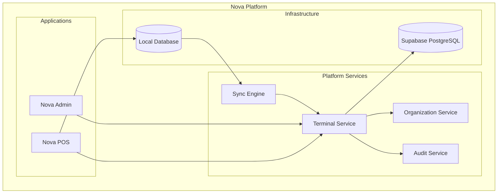
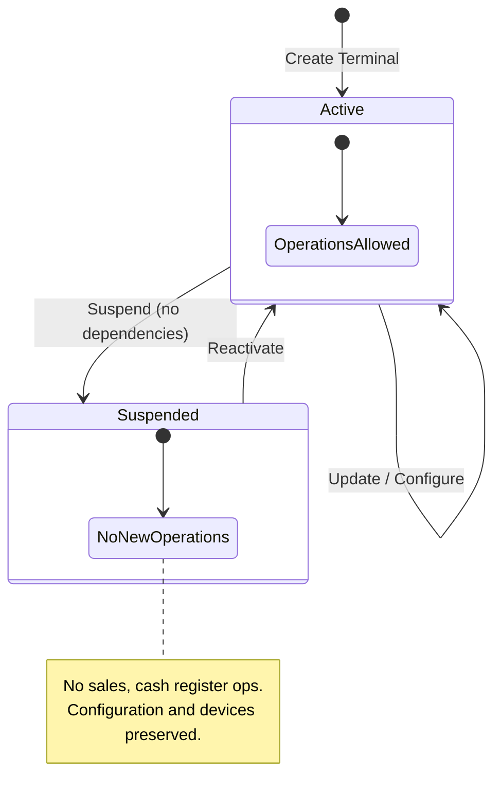
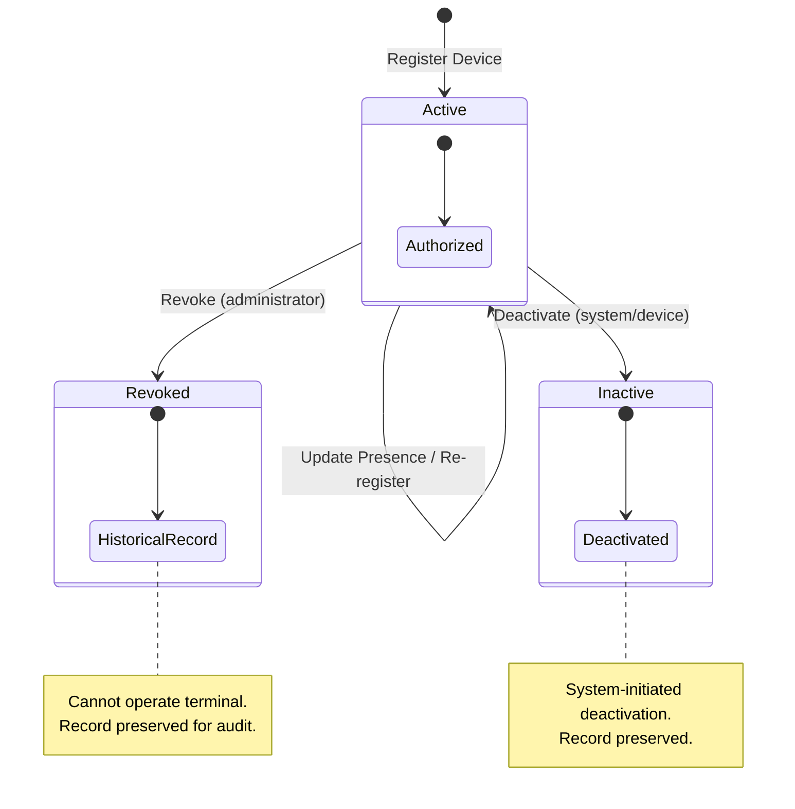

# Design Document: Terminal Management

## Overview

This document defines the technical design for the Terminal Management domain within Nova Platform. It covers the creation, configuration, lifecycle management, and device registration of terminals — the logical checkout stations where commercial operations are performed.

Terminal Management is a **product-level domain** consumed primarily by Nova POS. It depends on CORE-001 Organization Management for tenant context, branch association, and organizational configuration defaults.

### Key Design Drivers

- **Offline First**: Terminal, device registration, and configuration data must be available locally for Nova POS to operate without connectivity.
- **Multi-Tenant Isolation**: Every terminal operation is scoped to the current organization. Cross-tenant access is architecturally impossible.
- **Synchronization**: Changes made offline must queue locally and sync automatically when connectivity returns.
- **Auditability**: All structural changes to terminals, device registrations, and configuration must produce audit records.
- **Simplicity**: The design reuses established patterns from CORE-001 without introducing new architectural layers.

### Architectural Style

This module follows the same **Modular Monolith** architecture with **Lightweight DDD** and **Clean Architecture** principles established in CORE-001:

- The terminal domain is an independent module with clear boundaries.
- Communication with CORE-001 occurs through well-defined interfaces (Organization and Branch references).
- Business logic is encapsulated within the domain module. Infrastructure concerns are isolated.
- The architecture favors clarity over academic purity.

---

## Architecture

### System Context



### Data Flow Architecture

The data flow follows the identical pattern established in CORE-001:

1. User or Device performs an action through the UI or API.
2. Application Service validates and applies business rules via the Domain Layer.
3. Changes persist locally first (optimistic response).
4. A sync operation is enqueued for remote persistence.
5. The Sync Engine processes the queue when connectivity is available.

### Layered Architecture

| Layer | Responsibility | Location |
|-------|---------------|----------|
| **UI** | Forms, lists, terminal selection, device management | `apps/pos/`, `apps/admin/` |
| **Application** | Use case orchestration, transaction coordination | `packages/shared/domains/terminal/application/` |
| **Domain** | Business rules, invariants, state transitions, validation | `packages/shared/domains/terminal/domain/` |
| **Infrastructure** | Local persistence, remote API, sync queue integration | `packages/shared/domains/terminal/infrastructure/` |
| **Sync** | Reuses existing `packages/shared/sync/` engine | `packages/shared/sync/` |

### Layer Responsibilities

**Application Layer**
- Orchestrates use cases (create terminal, register device, update configuration, etc.)
- Coordinates between Domain Layer, persistence, and Sync Queue
- Enforces Tenant Context on every operation
- Records audit entries after successful domain operations
- Resolves Organization Configuration defaults when creating terminals
- Does NOT contain business rules

**Domain Layer**
- Owns all business rules and invariants for terminals and device registrations
- Validates inputs against domain constraints
- Controls state transitions (terminal lifecycle, device registration lifecycle)
- Defines Repository interfaces
- Does NOT know about persistence or infrastructure

**Infrastructure Layer**
- Implements Repository interfaces defined by the Domain Layer
- Manages local database read/write operations (IndexedDB via idb)
- Manages remote API calls (Supabase)
- Integrates with the shared Sync Queue

**Offline Layer**
- Ensures all reads resolve from the local store
- All writes persist locally first, then enqueue for synchronization
- Provides sync status metadata for UI indicators

**Synchronization Layer**
- Reuses the existing Sync Engine from `packages/shared/sync/`
- Terminal and device registration entities participate in the same queue
- No new synchronization infrastructure is required

---

## Domain Model

### Aggregate Boundary

```
┌─────────────────────────────────────────────────────────────┐
│                   Terminal Aggregate                         │
│                                                             │
│  ┌───────────────────────────────────────────────────────┐  │
│  │  Terminal (Aggregate Root)                             │  │
│  │                                                       │  │
│  │  - identity (id, code, name)                          │  │
│  │  - branch association                                 │  │
│  │  - status (lifecycle)                                 │  │
│  │  - TerminalConfiguration (Value Object)               │  │
│  └───────────────────────────────────────────────────────┘  │
│                                                             │
│  ┌───────────────────────────────────────────────────────┐  │
│  │  DeviceRegistration (Entity)                          │  │
│  │                                                       │  │
│  │  - identity (id, installationId)                      │  │
│  │  - device metadata (name, type, platform, version)    │  │
│  │  - status (lifecycle)                                 │  │
│  │  - presence (lastSeenAt)                              │  │
│  │  - always belongs to one Terminal                      │  │
│  └───────────────────────────────────────────────────────┘  │
│                                                             │
└─────────────────────────────────────────────────────────────┘
```

**Aggregate Root**: Terminal

The Terminal is the entry point for all operations within this domain. It enforces the consistency boundary and governs the lifecycle of its device registrations and configuration.

**Transactional consistency boundary:** The aggregate defines the scope within which business invariants must be satisfied before a state change is committed. DeviceRegistration is part of the Terminal aggregate because its invariants (installation ID uniqueness, lifecycle transitions) depend on the parent Terminal's state. Repository implementations may optimize loading strategies while preserving aggregate consistency at the persistence boundary.

**Business Invariants enforced by the Aggregate:**

1. A Terminal belongs to exactly one Branch at any given time.
2. A Terminal code must be unique within the Organization.
3. The Terminal controls its own configuration.
4. The Terminal controls its own lifecycle (active ↔ suspended).
5. A DeviceRegistration belongs to exactly one Terminal.
6. A device's Installation ID is globally unique across the platform.
7. A Terminal cannot be suspended while it has active sessions or pending operations.
8. A Terminal may exist without any registered devices.

### Aggregate Root: Terminal

Represents a logical checkout station within a branch. Commercial operations (sales, cash register) are performed through a terminal.

**Responsibilities:**
- Maintains identification (code, name) unique within the organization
- Associates with exactly one branch at any given time
- Owns its configuration (currency, language, timezone, peripheral settings)
- Controls its lifecycle status (active, suspended)
- Governs the registration and revocation of devices

### Entity: DeviceRegistration

Represents an authorized Nova POS installation associated with a terminal. A physical device that has been registered to operate a specific checkout station.

**Responsibilities:**
- Maintains device identity (installation ID, device name, type, platform, version)
- Controls its own lifecycle status (active, revoked, inactive)
- Records presence timestamps (lastSeenAt) without interpreting connectivity

### Value Object: TerminalConfiguration

Groups the operational settings that define how a terminal operates. Modeled as a Value Object because it has no independent identity — it exists only as part of a Terminal.

**Attributes:**
- currency — ISO 4217 code
- language — BCP 47 tag
- timezone — IANA timezone string
- offlineEnabled — whether the terminal can operate offline
- syncInterval — synchronization frequency preference
- receiptPrinterEnabled — whether receipt printing is available
- cashDrawerEnabled — whether a cash drawer is connected
- barcodeScannerEnabled — whether barcode scanning is available

**Design rationale:** Grouping configuration as a Value Object provides a single extensibility point. When new peripheral settings or operational modes are needed, the TerminalConfiguration can be extended without modifying the Terminal entity's identity or business rules.

**Default values:** When a terminal is created, configuration defaults are inherited from the parent Organization's configuration (currency, language, timezone). Peripheral settings default to disabled.

### Enumeration: TerminalStatus

- `active` — Terminal is operational and available for commercial operations.
- `suspended` — Terminal is temporarily disabled; no new operations allowed but data is preserved.

### Enumeration: DeviceRegistrationStatus

- `active` — Device is authorized to operate the terminal.
- `revoked` — Authorization has been explicitly removed by an administrator.
- `inactive` — Registration has been deactivated by the system or device.

### Domain Events

The Terminal domain currently operates **synchronously**, following the same pattern established in CORE-001. All operations execute within a single request lifecycle.

No asynchronous domain events are published in the current implementation.

As the platform evolves, the following events may be introduced:

- `TerminalCreated`
- `TerminalUpdated`
- `TerminalSuspended`
- `TerminalReactivated`
- `DeviceRegistered`
- `DeviceRevoked`
- `TerminalConfigurationUpdated`
- `TerminalConfigurationRestored`
- `DeviceHeartbeatReceived`

These are documented for architectural awareness and are **not part of the current design**.

---

## Components and Interfaces

### Domain Types

**Terminal:**
- id — UUID
- organizationId — UUID (tenant scope)
- branchId — UUID (branch association)
- code — string (unique within organization)
- name — string
- configuration — TerminalConfiguration (Value Object)
- status — TerminalStatus
- createdAt — ISO 8601 timestamp
- createdBy — UUID (actor identity)
- updatedAt — ISO 8601 timestamp
- updatedBy — UUID (actor identity)

**DeviceRegistration:**
- id — UUID
- terminalId — UUID (parent terminal)
- installationId — string (globally unique)
- deviceName — string
- deviceType — string (e.g., desktop, laptop, tablet, phone)
- platform — string (e.g., Windows, macOS, Android, iOS, Web)
- applicationVersion — string
- registeredAt — ISO 8601 timestamp
- lastSeenAt — ISO 8601 timestamp or null
- status — DeviceRegistrationStatus

**TerminalConfiguration:**
- currency — string (ISO 4217)
- language — string (BCP 47)
- timezone — string (IANA)
- offlineEnabled — boolean
- syncInterval — number (seconds)
- receiptPrinterEnabled — boolean
- cashDrawerEnabled — boolean
- barcodeScannerEnabled — boolean

### Validation

Pure validation functions with no side effects, following the same pattern as CORE-001:

- validateCreateTerminal — validates code (non-empty, reasonable length) and name (non-empty, reasonable length)
- validateUpdateTerminal — validates provided fields using the same constraints
- validateRegisterDevice — validates installationId (non-empty), deviceName (non-empty), deviceType (non-empty), platform (non-empty)

### Application Service

The Application Service orchestrates use cases by coordinating the Domain Layer, Repository interfaces, and cross-cutting concerns (audit, sync). It follows the same functional composition approach used in CORE-001.

**Use Cases:**
- createTerminal — validate → check code uniqueness → resolve config defaults → persist → enqueue sync → audit
- updateTerminal — validate → check code uniqueness → load → apply → persist → enqueue sync → audit
- suspendTerminal — load → check dependencies → lifecycle transition → persist → enqueue sync → audit
- reactivateTerminal — load → lifecycle transition → persist → enqueue sync → audit
- listTerminals — read from local store, scoped to branch
- getTerminalDetails — read from local store, include devices and configuration
- registerDevice — validate → check installationId uniqueness → handle re-registration → persist → enqueue sync → audit
- listRegisteredDevices — read from local store, scoped to terminal
- revokeDevice — load → lifecycle transition → persist → enqueue sync → audit
- updateDevicePresence — validate active status → update lastSeenAt → persist → enqueue sync
- updateConfiguration — load → apply changes → persist → enqueue sync → audit
- getConfiguration — read from local store
- restoreDefaultConfiguration — load → resolve org defaults → replace → persist → enqueue sync → audit

### Repository Interfaces

Defined by the Domain Layer, implemented by the Infrastructure Layer. Every operation is implicitly scoped to the current Tenant Context.

**TerminalRepository:**
- save(terminal) — persist a new terminal
- findById(orgId, terminalId) — retrieve by ID within organization
- findByCode(orgId, code) — retrieve by code for uniqueness checks
- findAllByBranch(orgId, branchId) — list all terminals for a branch
- update(terminal) — persist terminal changes
- hasActiveDependencies(orgId, terminalId) — check for active sessions or pending operations

**DeviceRegistrationRepository:**
- save(registration) — persist a new device registration
- findById(terminalId, registrationId) — retrieve by ID
- findByInstallationId(installationId) — retrieve by installation ID (global lookup)
- findAllByTerminal(terminalId) — list all registrations for a terminal
- update(registration) — persist registration changes

### Result Type

Reuses the existing `Result<T>` type from CORE-001. All Application Service operations return `Result<T>`.

### Tenant Context

Reuses the existing `TenantContext` interface from CORE-001. Every data operation is scoped to `organizationId` and `userId`.

### Audit Interface

Reuses the existing `AuditService` interface from CORE-001. The `entityType` field extends to include `'terminal'`, `'device_registration'`, and `'terminal_configuration'`.

---

## Data Models

### Domain Types Summary

| Type | Kind | Description |
|------|------|-------------|
| `Terminal` | Aggregate Root | A logical checkout station |
| `DeviceRegistration` | Entity | An authorized device installation |
| `TerminalConfiguration` | Value Object | Operational settings for a terminal |
| `TerminalStatus` | Enum | `'active'` or `'suspended'` |
| `DeviceRegistrationStatus` | Enum | `'active'`, `'revoked'`, or `'inactive'` |

---

## Persistence Strategy

### Remote Database (Supabase PostgreSQL)

Follows the same persistence patterns established in CORE-001.

**Key design decisions:**
- UUIDs as primary keys for all entities.
- Unique constraint on `(organization_id, code)` for terminals.
- Global unique constraint on `installation_id` for device registrations.
- Foreign key from terminals to branches (and transitively to organizations).
- Row Level Security (RLS) enforces tenant isolation at the database level.
- Status fields use CHECK constraints to enforce valid lifecycle states.
- TerminalConfiguration stored as JSONB within the terminals table.
- Timestamps use `TIMESTAMPTZ` for timezone-aware storage.

**Tables:**
- `terminals` — Terminal records with configuration as JSONB, foreign key to branches
- `device_registrations` — Device registration records with foreign key to terminals
- `audit_log` — Shared audit trail (reuses existing table, extended entity types)

### Local Database (IndexedDB)

Follows the same local persistence strategy established in CORE-001.

**Key design decisions:**
- Local records extend domain types with sync metadata (`_syncStatus`, `_lastSyncedAt`, `_localVersion`, `_remoteVersion`).
- Terminals indexed by organization ID and branch ID.
- Device registrations indexed by terminal ID and installation ID.
- The local store is the primary read source for all UI operations.

**Sync metadata per record:**

| Field | Purpose |
|-------|---------|
| `_syncStatus` | `synced`, `pending`, or `conflict` |
| `_lastSyncedAt` | Timestamp of last successful sync |
| `_localVersion` | Incremented on each local mutation |
| `_remoteVersion` | Version received from remote on last sync |

### Synchronization Strategy

Reuses the existing Synchronization Layer from `packages/shared/sync/`. Terminal and device registration entities participate in the same Sync Queue with entity types `'terminal'` and `'device_registration'`.

**Terminal-specific sync considerations:**
- Device presence updates (lastSeenAt) are low-priority sync operations — they do not block the UI.
- Terminal code uniqueness conflicts may be detected during sync (optimistic creation locally, conflict flagged on remote rejection).
- Installation ID global uniqueness is enforced at the remote database level — conflicts surface during sync.

---

## State Machines

### Terminal Lifecycle



**Transition rules:**
- Only active terminals can be suspended.
- Only suspended terminals can be reactivated.
- A terminal cannot be suspended while it has active sessions or pending operations.
- A suspended terminal preserves all data — configuration and device registrations remain intact.
- Configuration updates are allowed regardless of terminal status.

### Device Registration Lifecycle



**Transition rules:**
- Only active devices can be revoked or deactivated.
- Revocation is an administrator action; inactivation is a system/device action.
- Re-registration of the same installation ID to the same terminal reactivates/updates the existing record.
- Revoked and inactive records are preserved for audit and historical reporting.

---

## Validation Rules

### Terminal

| Field | Required | Constraints |
|-------|----------|-------------|
| `code` | Yes | Non-empty, max 50 chars, unique per organization |
| `name` | Yes | Non-empty, max 255 chars |

### DeviceRegistration

| Field | Required | Constraints |
|-------|----------|-------------|
| `installationId` | Yes | Non-empty, globally unique |
| `deviceName` | Yes | Non-empty, max 255 chars |
| `deviceType` | Yes | Non-empty, max 50 chars |
| `platform` | Yes | Non-empty, max 50 chars |

---

## Error Handling

### Strategy

Follows the same `Result<T>` error handling strategy established in CORE-001.

### Error Categories

| Category | Code | HTTP Status | Description |
|----------|------|-------------|-------------|
| Validation | `VALIDATION_ERROR` | 400 | Input does not meet field requirements |
| Conflict | `DUPLICATE_TERMINAL_CODE` | 409 | Terminal code already exists in organization |
| Conflict | `INSTALLATION_ID_CONFLICT` | 409 | Installation ID already registered to another terminal |
| Not Found | `TERMINAL_NOT_FOUND` | 404 | Terminal does not exist |
| Not Found | `DEVICE_NOT_FOUND` | 404 | Device registration does not exist |
| State | `INVALID_STATE_TRANSITION` | 422 | Operation not valid for current status |
| State | `TERMINAL_HAS_DEPENDENCIES` | 422 | Terminal has active sessions or pending operations |
| State | `DEVICE_NOT_ACTIVE` | 422 | Operation requires an active device registration |
| Authorization | `TENANT_VIOLATION` | 403 | Cross-tenant access attempt |
| Sync | `SYNC_FAILED` | — | Synchronization failed (retryable, not user-facing) |

---

## Correctness Properties

### Property 1: Terminal creation round-trip

*For any* valid terminal input and existing branch, creating a terminal and then retrieving it SHALL return a terminal with: a valid UUID, status `'active'`, all input fields preserved, default configuration inherited from organization, and `createdBy` matching the performing actor.

**Validates: Requirements 1.1, 1.3, 1.7, 1.9, 6.1**

### Property 2: Terminal code uniqueness per organization

*For any* two terminal creation requests with the same code within the same organization, the first SHALL succeed and the second SHALL be rejected with a `DUPLICATE_TERMINAL_CODE` error.

**Validates: Requirements 1.5, 2.3**

### Property 3: Terminal validation rejects invalid input without side effects

*For any* terminal creation input where code or name is empty, whitespace-only, or exceeds maximum length, the system SHALL reject with a validation error and no terminal SHALL be persisted.

**Validates: Requirements 1.4, 1.6**

### Property 4: Terminal lifecycle state transitions

*For any* active terminal with no dependencies, suspension SHALL set status to `'suspended'`. *For any* suspended terminal, reactivation SHALL set status to `'active'`. Invalid transitions SHALL be rejected.

**Validates: Requirements 3.1, 3.4, 4.1, 4.3**

### Property 5: Device registration round-trip

*For any* valid device registration input and existing active terminal, registering a device SHALL create a record with status `'active'`, the provided installation ID preserved, and a registration timestamp.

**Validates: Requirements 7.1, 7.3, 7.7**

### Property 6: Installation ID global uniqueness

*For any* device registration with an installation ID already registered to a different terminal (regardless of organization), the registration SHALL be rejected.

**Validates: Requirements 7.4, 7.6**

### Property 7: Device re-registration to same terminal

*For any* device with an installation ID already registered to the same terminal, the system SHALL update the existing registration rather than creating a duplicate.

**Validates: Requirements 7.5**

### Property 8: Device revocation preserves history

*For any* active device registration, revocation SHALL change status to `'revoked'` and the record SHALL remain accessible for queries. The terminal SHALL remain valid regardless of remaining device count.

**Validates: Requirements 9.1, 9.3**

### Property 9: Terminal exists without devices

*For any* terminal, the terminal SHALL remain valid and operational regardless of whether it has zero, one, or many registered devices.

**Validates: Requirements 1.8, 9.3**

### Property 10: Configuration restore inherits organization defaults

*For any* terminal, restoring default configuration SHALL replace all configuration values with those inherited from the parent organization's configuration.

**Validates: Requirements 13.1**

### Property 11: Device presence only persists timestamp

*For any* active device presence update, the system SHALL update only `lastSeenAt`. No connectivity determination SHALL be made by this module.

**Validates: Requirements 10.1, 10.4**

### Property 12: Tenant isolation enforcement

*For any* terminal or device operation with a Tenant Context specifying organization A, and any data belonging to organization B (where A ≠ B), the operation SHALL NOT access, modify, or return organization B's data.

**Validates: Requirements 14.1, 14.2, 14.3, 14.4**

### Property 13: Audit trail completeness

*For any* mutation operation on a terminal, device registration, or terminal configuration, the system SHALL produce an audit entry containing the action, entity type and ID, actor identity, and timestamp.

**Validates: Requirements 16.1**

---

## Dependencies on CORE-001

This module reuses the following from CORE-001 without duplication:

- **Result<T> type** — shared result model for all operations
- **AppError and FieldError** — shared error types
- **ok() and fail() helpers** — shared result construction
- **TenantContext** — shared tenant scoping mechanism
- **ValidationResult** — shared validation result type
- **AuditService interface** — shared audit recording (extended entity types)
- **SyncQueue interface** — shared sync queue (extended entity types)
- **SyncEngine** — shared sync processing (no changes required)
- **Shared database initialization** — IndexedDB database.ts extended with terminal stores
- **OrganizationConfiguration** — referenced for default terminal configuration values

---

## Testing Strategy

### Dual Testing Approach

This module follows the same testing philosophy established in CORE-001.

#### Property-Based Tests

**Library**: fast-check (TypeScript)

Each correctness property is implemented as a property-based test with minimum 100 iterations. Custom arbitraries generate random valid/invalid inputs for terminal creation, device registration, lifecycle transitions, and configuration operations.

**Configuration:**
- Minimum 100 iterations per property (`numRuns: 100`)
- Seed-based reproducibility for CI failures
- Separate test file per property group

#### Unit Tests (Example-Based)

Focus areas:
- Specific field validation scenarios
- Configuration default resolution
- Error message content verification
- Device re-registration logic
- Presence update behavior

#### Integration Tests

Focus areas:
- Local database offline read/write for terminals and devices
- Sync queue: offline terminal/device changes → reconnect → sync to remote
- RLS policy enforcement for terminal tenant isolation
- Operations blocked for suspended terminals
- Installation ID global uniqueness enforcement across organizations

### Test Organization

```
packages/shared/domains/terminal/
├── __tests__/
│   ├── terminal.properties.test.ts
│   ├── device-registration.properties.test.ts
│   ├── terminal-lifecycle.properties.test.ts
│   ├── tenant-isolation.properties.test.ts
│   ├── audit.properties.test.ts
│   ├── terminal.unit.test.ts
│   ├── device-registration.unit.test.ts
│   └── arbitraries.ts
├── __integration__/
│   ├── offline.integration.test.ts
│   ├── sync.integration.test.ts
│   └── rls.integration.test.ts
```

---

## UI Organization

### Admin Application

**Pages:**
- Terminal List (per branch) — table with code, name, status, device count
- Terminal Details — full profile with configuration and registered devices
- Create Terminal — form with code and name fields
- Edit Terminal — form for updating code and name
- Terminal Configuration — form for all operational settings
- Terminal Lifecycle — suspend/reactivate actions with confirmation
- Device List (per terminal) — table with device info, status, presence
- Device Revocation — action with confirmation dialog

**Validation responsibility:** UI performs client-side validation for immediate user feedback. Business validation (code uniqueness, installation ID uniqueness, lifecycle transitions) belongs to the Domain Layer.

### POS Application

**Pages:**
- Terminal Selection — list of available terminals for the current branch
- Terminal Status — current terminal's sync status and configuration summary

**Design rationale:** The POS application consumes terminal data primarily in read-only capacity for session initialization. Terminal management (creation, configuration, device registration) is performed through the Admin application.
